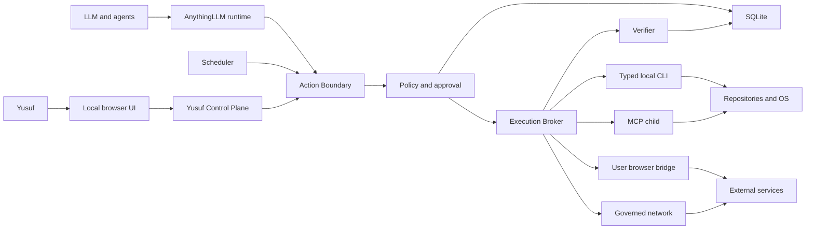

# Yusuf OS Threat Model

## Executive summary

Yusuf OS intentionally places an LLM near high-value local identities, repositories, browser sessions, and future external accounts. The dominant risks are execution-policy bypass, prompt/tool-output injection crossing into privileged adapters, credential exfiltration, stale or duplicated mutations, and false evidence. AnythingLLM currently has confirmed direct execution paths—including MCP, flows, scheduled auto-approval, imported in-process code, and raw SQL—that cannot be treated as governed Yusuf capabilities until they terminate at the mandatory Action Boundary. The design reduces these risks with fail-closed localhost control, adapter-neutral intents, durable payload-bound approval, typed adapters, independent verification, tamper-evident audit, and explicit exclusion of uncontainable extensions.

## Scope and assumptions

- In scope: `server/` agent runtime, scheduled jobs, MCP, imported skills, Agent Flows, SQL tooling, Prisma/SQLite, internal HTTP/auth boundaries, and future Yusuf OS contracts; `frontend/` control-plane and realtime contract; LocalGit/CLI/browser adapter designs.
- Deployment assumption: personal single-user production on Yusuf's local machine; Yusuf mutations are localhost-only and authenticated fail-closed.
- Data sensitivity: high. The system may access proprietary source, career data, local credentials, authenticated browser state, approvals, and future communications.
- The LLM, prompts, repository content, web content, MCP results, CLI output, and external services are untrusted.
- Out of scope for implementation: Open Computer, external platform integrations, production browser automation, and sandbox implementation. They remain in threat analysis where their future boundary matters.
- Yusuf/local OS administrator is trusted to install software and configure the host. Protection against a fully compromised kernel or an administrator rewriting every database and checkpoint is not claimed.

The Gate B charter explicitly resolves deployment, user count, control-plane exposure, database, browser-session preference, and data sensitivity; no remaining context question materially blocks this model. Risk changes if the service is later exposed beyond localhost, becomes multi-user, or runs untrusted third-party code.

## System model

### Primary components

- AnythingLLM React UI and Express API.
- AIbitat model/tool runtime and ephemeral execution.
- Yusuf Control Plane: identity, tasks, canonicalization, policy, approvals, audit, projections.
- Execution Broker and typed adapters.
- Scheduled coordinator and reconciler.
- Prisma with local SQLite.
- Local Git/filesystem/CLI resources.
- Future governed bridge to Yusuf's existing Chrome session.
- MCP child processes and governed network/SQL adapters.

### Data flows and trust boundaries

- Yusuf → local browser UI: decisions, tasks, approvals; browser session; UI must prevent stale/ambiguous actions.
- Browser UI → Yusuf Control Plane: authenticated localhost HTTP/SSE; strict origin/session/schema/body limits and optimistic versions required.
- LLM/Agent → AnythingLLM runtime: untrusted prompts, plans, structured tool requests; schema validation but no authority.
- Runtime/Scheduler → Action Boundary: semantic requests; canonicalization and durable policy required before effects.
- Action Boundary → SQLite: intents, decisions, approvals, claims, receipts, redacted evidence, audit; short transactions and conditional transitions.
- Broker → Local CLI/filesystem: typed arguments and minimal environment; no raw shell, path/symlink escape, or inherited secrets.
- Broker → existing browser session: typed observation/action bridge; no cookies/tokens exported; account/origin preflight.
- Broker → MCP child: individual capability authorization, minimal environment, untrusted response.
- Broker → external service: governed browser/network/CLI operation; external side effect is not atomic with SQLite.
- Verifier → external/local target: independent state observation; results remain untrusted until normalized and persisted.

#### Diagram

## Assets and security objectives

| Asset | Why it matters | Security objective (C/I/A) |
|---|---|---|
| Yusuf identity and approval authority | Distinguishes human authorization from model/system activity | C/I/A |
| Browser sessions and cookies | May authorize email, career, social, or financial actions | C/I |
| CLI credentials and API keys | Permit remote source/service mutations | C/I |
| Repositories and source code | Proprietary work and software supply-chain integrity | C/I/A |
| Local filesystem | Personal/project data and executable configuration | C/I/A |
| Policy and approval state | Determines what agents may do | I/A |
| Audit chain | Incident reconstruction and accountability | I/A |
| Tasks, runs, intents, receipts | Durable operational truth | I/A |
| Career and future communications | Sensitive personal information and reputation | C/I |
| Project/customer data | Commercial confidentiality and correctness | C/I/A |
| Model/tool inputs and outputs | Can carry prompt injection and secrets | C/I |
| Cost/budget state | Prevents uncontrolled resource spending | I/A |

## Attacker model

### Capabilities

- Supply malicious instructions through prompts, repository files, issues, web pages, documents, MCP/tool results, or future inbound communications.
- Trigger exposed AnythingLLM routes if local-network/browser protections fail.
- Cause duplicate delivery, timeouts, crashes, stale reads, adapter fallback, and reordered realtime events.
- Operate a malicious or compromised MCP server, imported skill, repository, CLI output, web page, or external service response.
- Attempt path traversal, symlink/junction escape, SSRF, command injection, account confusion, and secret reflection.
- Modify local SQLite or evidence files if they obtain host file access; hash chaining should make ordinary alteration detectable.

### Non-capabilities

- No assumed kernel/admin compromise in normal risk ranking.
- No assumed ability to defeat Chrome/OS cryptography directly.
- No internet-reachable Yusuf mutation plane in the intended deployment.
- No trusted ability for an Agent to approve, alter Policy, or alter security Audit.
- Open Computer and arbitrary imported skills are not enabled as governed Yusuf execution in v1.

## Entry points and attack surfaces

| Surface | How reached | Trust boundary | Notes | Evidence |
|---|---|---|---|---|
| Express API | HTTP `/api` | Browser/network → server | Current CORS/body/auth posture must not be inherited | `server/index.js:49-72`; `server/utils/middleware/validatedRequest.js:8-24` |
| Agent WebSocket | Invocation UUID | Browser → runtime | Transient approval/session channel | `server/endpoints/agentWebsocket.js:26`; `server/utils/agents/aibitat/plugins/websocket.js:194-303` |
| AIbitat handlers | Model tool call | LLM → server function | Direct handler invocation lacks mandatory policy | `server/utils/agents/aibitat/index.js:1039-1082,1201-1245` |
| Scheduled jobs | Cron/manual trigger | Scheduler → ephemeral agent | Existing path auto-approves | `server/jobs/run-scheduled-job.js:61-83` |
| MCP | Enabled MCP tool | Child/external process ↔ server | Direct `callTool`, broad environment | `server/utils/MCP/index.js:78-105`; `server/utils/MCP/hypervisor/index.js:300-336` |
| Imported skills | Installed `handler.js` | Local code package → server process | In-process arbitrary JS and fail-open helper | `server/utils/agents/imported.js:15-24,170-194` |
| Agent Flow API call | Agent selects flow | LLM → arbitrary network | Method/URL/headers/body direct fetch | `server/utils/agentFlows/executors/api-call.js:9-43` |
| SQL agent | Model query | LLM → database | Read-only claim is prompt text | `server/utils/agents/aibitat/plugins/sql-agent/query.js:15-16,61-82` |
| SQLite | Server models | process → local DB | App-level status/JSON conventions | `server/prisma/schema.prisma:13-15`; `server/utils/prisma/index.js:1-13` |
| LocalGit/CLI future adapter | Broker call | server → OS/repository | Path, command, environment and identity critical | Gate B adapter contract |
| Existing browser future bridge | Broker call | server → authenticated browser | Account confusion and prompt injection critical | Gate B browser contract |

## Top abuse paths

1. A malicious repository instruction asks the Engineering Agent to “verify” a secret; a raw tool reads `.env`; output enters the model/logs; credential is exfiltrated.
2. A scheduled task selects an email/browser/MCP mutation; legacy scheduler auto-approves; external action occurs without Yusuf's durable decision.
3. A compromised MCP server advertises a benign tool but performs hidden filesystem/network effects using inherited environment credentials.
4. A web page injects instructions into observed content; the Agent converts them into a publish/send operation against Yusuf's authenticated browser session.
5. Yusuf approves pushing SHA A; repository changes to SHA B before execution; a TOCTOU bug pushes unreviewed code.
6. CLI reports timeout after remote push; worker retries blindly; duplicate external mutation or conflicting state results.
7. Adapter fallback switches from the expected account to another logged-in account; semantically similar action affects the wrong identity.
8. Flow API block targets a private/metadata endpoint and forwards secrets through attacker-controlled redirects.
9. An attacker or defective component changes approval/audit rows; UI shows fabricated authorization or hides an action.
10. A symlink inside an allowlisted project redirects a write to a credential or policy path outside the project root.

## Threat model table

| Threat ID | Threat source | Prerequisites | Threat action | Impact | Impacted assets | Existing controls (evidence) | Gaps | Recommended mitigations | Detection ideas | Likelihood | Impact severity | Priority |
|---|---|---|---|---|---|---|---|---|---|---|---|---|
| TM-001 | Agent/tool author | Governed tool can reach direct handler | Bypass Policy/Approval and execute side effect | Unauthorized local/external mutation | Repos, accounts, policy authority | Some tools voluntarily request approval | No mandatory gate; direct calls at `aibitat/index.js:1082,1245` | Central dispatcher; deny unregistered effects; negative bypass tests | Audit every handler dispatch and alert missing intent | high | high | critical |
| TM-002 | Scheduler/task content | L3/L4 tool selected by schedule | Auto-approve unattended mutation | Unauthorized persistent external effect | Accounts, communications, repos | Run records exist | Explicit auto-approval at `run-scheduled-job.js:76-83` | Durable suspend/resume; no-channel fail-closed | Alert scheduled mutation without approval ID | high | high | critical |
| TM-003 | Prompt/repository/web content | Agent consumes attacker-controlled text | Prompt injection requests privileged action or hides target | Secret loss or wrong action | Source, sessions, credentials | Model/tool separation exists | Tool authority too broad and output untrusted | Capability schemas, Policy, target previews, forbidden set, independent verification | Record injection indicators and anomalous capability requests | high | high | critical |
| TM-004 | Compromised MCP server | Server enabled and child launched | Hidden effects or secret theft using inherited env | Host/account compromise | CLI secrets, filesystem, source | MCP suppression/discovery | Server enable implies broad availability; env inheritance | Per-tool capabilities, minimal env, isolation, verification | MCP executable/schema digest changes; unexpected network/process activity | medium | high | critical |
| TM-005 | Imported skill | Operator installs arbitrary Node skill | Module-load/direct JS side effect bypasses broker | Server-process compromise | All process-accessible assets | Local installation required | `require()` executes in-process before broker | Exclude from governed core; `TRUSTED_LOCAL_CODE` warning or future sandbox | Inventory/digest installed code; startup change alert | medium | high | critical |
| TM-006 | Malicious SQL/tool output | SQL agent configured with privileged credential | Execute mutation/DDL despite “read-only” prompt | Data destruction/exfiltration | Connected databases | Tool description says read-only | Raw query executed by connectors | Read-only credentials/mode, parser, one statement, time/row limits | Log query digest/classification and rejected forms | medium | high | high |
| TM-007 | Flow author/prompt | API-call flow is active | SSRF or unapproved POST/PATCH/DELETE | Internal access, secret forwarding, external mutation | Local services, credentials, accounts | Flow persistence and step types | Direct arbitrary fetch | Step interception, origin/network/redirect/header/size policy | Denied private destinations, redirect and egress telemetry | high | high | critical |
| TM-008 | Remote/LAN/browser attacker | Service reachable and secrets absent/misconfigured | Abuse fail-open single-user control routes | Full control-plane mutation | Approval/policy/tasks | Existing `validatedRequest` in many routes | Bypass in dev/missing secrets; permissive CORS/body limits | Separate localhost listener/guard, fail startup closed, strict origin/session/CSRF/body limits | Startup health invariant and rejected non-loopback requests | medium | high | critical |
| TM-009 | Race/stale client | Resource changes after approval | Execute altered payload/SHA/target | Unreviewed mutation | Repos, accounts, approvals | None durable today | No payload/resource binding | Canonical hash, versions, preflight, invalidation | Count stale/invalidation events | high | high | critical |
| TM-010 | Crash/retry | Side effect occurs before DB receipt | Blind retry duplicates mutation | Duplicate email/push/application | External systems, operational truth | Scheduled run status exists | DB/external operation non-atomic | Server execution key, `FAILED_UNKNOWN`, reconcile before retry | Alert unknown outcomes and lease expiry | medium | high | high |
| TM-011 | Account/session change | Multiple browser/CLI accounts or expired login | Fallback uses wrong active identity | Reputational/data harm | Yusuf identity, external accounts | Provider may expose account info | No canonical account binding | Safe identity preflight, approved account constraints, invalidate mismatch | Account-change events and blocked executions | medium | high | high |
| TM-012 | Model/adapter | Adapter fallback available | Downgrade validation or broaden permission scope | Policy evasion | Approval authority, target data | None centralized | Adapter semantics not compared | Semantic-effect digest and re-policy; no adapter-owned risk | Log fallback and policy delta | medium | high | high |
| TM-013 | Model/repository path | Writable project contains traversal/symlink/junction | Escape allowlisted root | Credential/policy/source corruption | Filesystem, secrets, audit | OS path primitives | Naive prefix checks are bypassable | Canonical real paths, handle checks, protected paths, no raw shell | Denied escape telemetry and file-integrity checks | medium | high | high |
| TM-014 | CLI/model output | Command accepts model text or inherited env | Command injection or secret reflection | Arbitrary execution/exfiltration | Host, credentials, source | Process spawning exists elsewhere | Raw shell would be unsafe | Typed argv registry, shell disabled, minimal env, output limits/redaction | Command definition and redaction alerts | medium | high | critical |
| TM-015 | DB/file attacker or buggy admin | Write access to SQLite/audit | Alter/delete/reorder audit or forge receipt | False accountability and unsafe continuation | Audit, receipts, approval trust | Existing event log records activity | Existing log deletable; no chain | Dedicated append-only API, chained hashes, integrity check, future checkpoints | Periodic chain verification and startup alarm | medium | high | high |
| TM-016 | Malicious verifier/output | Verifier trusts same untrusted response as executor | Forge success evidence | Task marked complete without effect | Operational truth, task graph | Existing traces capture output | No independent verification contract | Separate verifier, resource observation, evidence digest, completion gates | Receipt/target mismatch metrics | medium | medium | high |
| TM-017 | Scheduler/event replay | Duplicate trigger/wakeup/realtime event | Double run/decision/execution | Duplicate effects and confusing UI | Tasks, approvals, external state | Queue concurrency partly limited | No complete idempotent state machine | Conditional claims, unique keys, event dedup/snapshot reconciliation | Duplicate claim conflicts and sequence-gap metrics | medium | high | high |
| TM-018 | Secret-bearing tool/service | Secret appears in stdout, URL, headers, screenshot | Persist or expose credential to LLM/UI/audit | Credential theft | Sessions, API keys, private keys | Some application logging conventions | Raw scheduled traces persist args/results | Evidence classes, pre/post redaction, forbidden capture, bounded retention | Secret-scanner counters without recording secret | high | high | critical |
| TM-019 | Agent/system component | Component can mutate policy/approval/audit records | Self-authorize or erase evidence | Total authority compromise | Policy, approval, audit | Admin/user routes exist for settings | No Yusuf principal model yet | USER-only admin services; agents forbidden; DB/service separation and audit | Alert any non-USER administrative attempt | medium | high | critical |
| TM-020 | Local resource exhaustion | Large request/tool output/job loop | Exhaust memory/disk/CPU | Control-plane unavailable; audit loss | Availability, DB, cost | Some timeouts/queue limits | Global 3GB bodies and raw trace growth | Route limits, quotas, budgets, bounded output/evidence retention | Disk, queue, cost, body rejection metrics | medium | medium | medium |

## Criticality calibration

- **Critical:** plausible path to unapproved external mutation, session/credential theft, arbitrary host execution, or self-authorization. Examples: direct handler bypass, inherited-secret arbitrary shell, scheduled auto-approval.
- **High:** substantial integrity/confidentiality harm requiring a race, configured integration, or partial local access. Examples: stale SHA push, wrong browser account, broken audit chain, duplicate mutation after crash.
- **Medium:** availability or bounded information harm with visible recovery. Examples: local queue/disk exhaustion, loss of non-secret short-lived evidence, stale dashboard projection corrected by snapshot.
- **Low:** cosmetic or low-sensitivity metadata issues with no authority effect. Examples: delayed non-critical status hint, missing optional account label while mutation remains blocked, presentation-only ordering defect.

If the mutation plane becomes network-accessible or multi-user, TM-008, IDOR/session, CSRF, rate limiting, and tenant-boundary threats require re-ranking and a new model.

## Focus paths for security review

| Path | Why it matters | Related Threat IDs |
|---|---|---|
| `server/utils/agents/aibitat/index.js` | Final direct tool dispatch points | TM-001, TM-003 |
| `server/jobs/run-scheduled-job.js` | Explicit unattended auto-approval and raw traces | TM-002, TM-017, TM-018 |
| `server/utils/agents/ephemeral.js` | Scheduled/API agent context and tool expansion | TM-001, TM-017 |
| `server/utils/MCP/index.js` | Direct MCP tool calls | TM-004 |
| `server/utils/MCP/hypervisor/index.js` | Child process environment and arbitrary code boundary | TM-004, TM-014 |
| `server/utils/agents/imported.js` | In-process arbitrary extension loading | TM-005, TM-019 |
| `server/utils/agentFlows/executor.js` | Flow step interception point | TM-007 |
| `server/utils/agentFlows/executors/api-call.js` | Arbitrary network request path | TM-007 |
| `server/utils/agents/aibitat/plugins/sql-agent/` | Raw SQL path and connector credentials | TM-006 |
| `server/utils/middleware/validatedRequest.js` | Current single-user auth bypass semantics | TM-008 |
| `server/index.js` | CORS/body/listener boundary | TM-008, TM-020 |
| `server/models/eventLogs.js` | Deletable/fail-open existing logs | TM-015 |
| `server/prisma/schema.prisma` | Durable authority and relational constraints | TM-009, TM-010, TM-015, TM-017 |
| `frontend/src/utils/chat/agent.js` | Transient approval/realtime lifecycle | TM-002, TM-009, TM-017 |
| `frontend/src/components/WorkspaceChat/ChatHistory/ToolApprovalRequest/` | Existing coarse approval presentation | TM-009, TM-011 |

## Residual risks

- A compromised local administrator can rewrite SQLite and local checkpoints; hash chaining detects ordinary tampering but is not immutable.
- In-process AnythingLLM core remains highly privileged; Action Boundary reduces governed execution risk but is not an OS sandbox.
- Browser pages and MCP processes may perform covert behavior not visible in declared output; independent verification and least privilege reduce but do not eliminate it.
- Safe account identity may not be detectable for every CLI/browser service; external mutations must block or require an explicitly stronger user flow when identity is unknown.
- SQL parsers are dialect-incomplete; read-only database credentials remain necessary.
- Redaction cannot mathematically recognize every novel secret; minimize capture and expose high-risk evidence only when necessary.
- A malicious adapter implementation is trusted code; installation, provenance, review, and isolation remain future supply-chain work.

## Quality check

- [x] Covered HTTP, WebSocket, runtime handlers, schedules, MCP, imported skills, flows, SQL, SQLite, CLI, browser, and external-service entry points.
- [x] Represented every identified trust boundary in threats.
- [x] Separated current runtime evidence from future contracts and deferred Open Computer.
- [x] Reflected charter-confirmed localhost, single-user, SQLite, browser-session, and sensitive-data assumptions.
- [x] Added evidence anchors for current-code claims.
- [x] Mapped mitigations, detection, likelihood, impact, priority, and residual risks.

