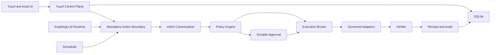
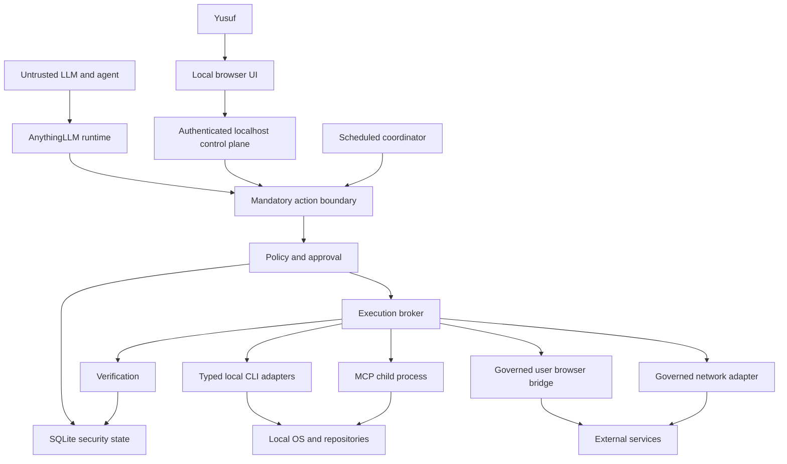

# Yusuf OS Architecture

## 1. Architecture overview

AnythingLLM remains the model, conversation, RAG, provider, and tool-discovery runtime. Yusuf OS adds an isolated control plane that owns authority, durable workflow state, execution planning, verification, and audit.



The model never decides authority. It may propose `capability + resource + target + desired payload`; the canonicalizer and Policy Engine produce the authoritative decision.

## 2. Bounded-context map

| Context | Owns | Must not own |
|---|---|---|
| Identity | Principals, authenticated Yusuf session, component identities | Capabilities or risk |
| Agent Registry | AgentDefinition, instruction/version, capability requests, model policy | Execution authority |
| Task Orchestration | Tasks, dependencies, handoffs, completion gates, runs | Adapter calls |
| Intent Canonicalization | Semantic action normalization, target identity, payload hash, resource preconditions | Risk or adapter selection |
| Policy | Capability resolution, constraints, risk, `ALLOW/REQUIRE_APPROVAL/DENY/FORBIDDEN` | Side effects |
| Approval | Durable human decision bound to intent/policy/resource versions | Execution |
| Execution Planning | Candidate adapters, safe account identity, preflight, selected adapter | Changing semantic intent |
| Execution Broker | Atomic claim, server execution key, adapter invocation | Policy mutation |
| Verification | Independent effect checks and uncertainty classification | Re-authorizing actions |
| Audit | Canonical security events, hash chain, integrity checks | Deleting history with parent entities |
| Adapter Registry | Typed capabilities, availability, safe identity metadata | Inferred authorization |
| Scheduling | Durable trigger, run creation, suspend/resume | Approval fallback |
| Knowledge/Evidence | sourced facts, evidence class, retention, provenance | Secrets or conversational preferences |
| Realtime Projection | ordered durable-event delivery and snapshot cursors | Source-of-truth state |

Dependency direction is inward toward semantic contracts: runtime and scheduler call the Action Boundary; adapters implement broker-owned interfaces; no agent or adapter imports Approval storage to manufacture authority.

## 3. Trust-boundary diagram



The LLM, repository content, tool output, MCP process, web page, external service, and imported extension are untrusted. The local OS is trusted to enforce process/filesystem primitives but is not assumed uncompromised against a local administrator.

## 4. Principal and identity flow

Every security-significant record uses structured principal references:

- `USER`: Yusuf acting through an authenticated local session.
- `AGENT`: an AgentDefinition version requesting work.
- `SCHEDULE`: a durable schedule definition that initiated a run.
- `SYSTEM`: a named Yusuf OS component such as coordinator, broker, verifier, or reconciler.

Each action records three distinct roles:

1. `requestedByPrincipal`: immediate initiator of the semantic request.
2. `owningAgentId`: accountable agent, if any.
3. `executedByComponent`: trusted component that claimed and invoked the adapter.

Human approval records always reference a `USER` principal and cannot be manufactured by `AGENT`, `SCHEDULE`, or generic `SYSTEM` principals.

## 5. Mandatory action boundary

All governed execution terminates in one logical boundary even when legacy interception requires several wrappers:

```text
ActionRequest
→ Canonicalize
→ Persist ActionIntent
→ Evaluate and persist PolicyDecision
→ deny / forbid / authorize / wait
→ create ExecutionPlan
→ preflight and re-policy if context changed
→ claim execution
→ invoke typed adapter
→ verify independently
→ receipt and audit
```

### Existing-path interception plan

| Existing path | Interception strategy | Initial posture |
|---|---|---|
| AIbitat direct handler calls | Replace both dispatch points with governed dispatcher for registered side-effecting tools | Mandatory |
| Scheduled Jobs | Remove auto-approval; create Task/Run/Intent and suspend durably | Mandatory |
| MCP | Discovery remains; each tool maps to a capability and executes only through broker | Disabled for governed mutation until mapped |
| Agent Flows | Intercept each step; network/API steps become governed network capabilities | Mutation denied until implemented |
| Imported Node skills | Cannot be contained by handler wrapper; exclude from Yusuf governed agents | `TRUSTED_LOCAL_CODE` outside policy or deferred |
| SQL tools | Typed read-only query adapter with deterministic checks and read-only credentials | Existing raw query tool excluded |
| Open Computer | Future isolated adapter candidate | Deferred |
| Direct internal Yusuf APIs | Mutations create intents or operate on control state with strict principal checks | Localhost and fail-closed |

## 6. Completion gates

An AgentRun is not complete merely because the model returned “done.” A Task may complete only when all required gates are satisfied:

- dependencies completed;
- required outputs persisted;
- all action intents terminal;
- no unresolved `FAILED_UNKNOWN`;
- required verification receipts are `VERIFIED`;
- reviewer/security gates pass where configured;
- no pending approval;
- cancellation/expiry rules evaluated.

## 7. Upstream compatibility

- New code is isolated under Yusuf namespaces and routes.
- Existing workspace, chat, memory, provider, and developer API contracts remain unchanged initially.
- Runtime changes are limited to narrow interception hooks with compatibility adapters for legacy tools.
- No historical Prisma migration is edited.
- Git topology before Gate C:

```text
origin   -> Yusuf-owned fork
upstream -> Mintplex-Labs/anything-llm
work     -> feature/yusuf-os-*
```

Gate B does not modify remotes or branches.

