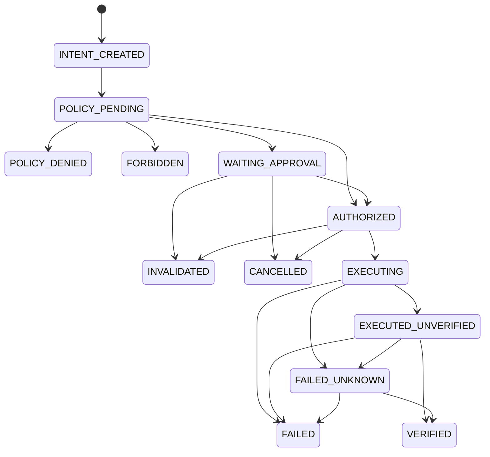
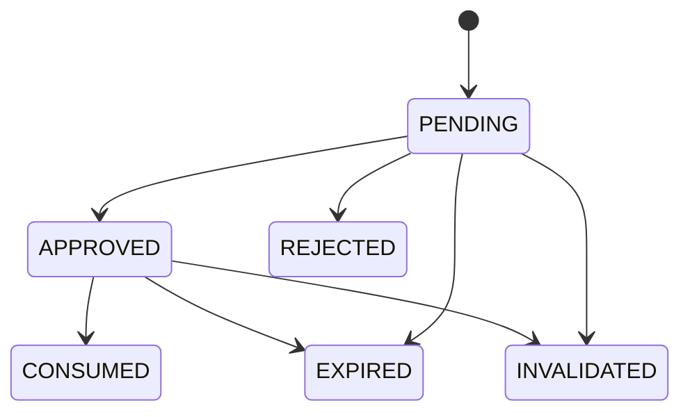

# State Machines and Persistence

## 1. Action lifecycle

The action lifecycle uses one status on `ActionIntent` plus separate Approval and Receipt records. The names make authorization, execution, and verification distinct.



`FORBIDDEN` is terminal and creates no ApprovalRequest. `POLICY_DENIED` is terminal for that intent; a changed request or policy creates a new intent and decision rather than rewriting history.

### Legal action transitions

| From | To | Guard |
|---|---|---|
| `INTENT_CREATED` | `POLICY_PENDING` | Canonical payload persisted |
| `POLICY_PENDING` | `POLICY_DENIED` | Decision=`DENY` |
| `POLICY_PENDING` | `FORBIDDEN` | Decision=`FORBIDDEN` |
| `POLICY_PENDING` | `WAITING_APPROVAL` | Decision=`REQUIRE_APPROVAL`; durable request created in same transaction |
| `POLICY_PENDING` | `AUTHORIZED` | Decision=`ALLOW` |
| `WAITING_APPROVAL` | `AUTHORIZED` | Matching non-expired approval atomically consumed |
| `WAITING_APPROVAL` | `INVALIDATED` | Payload/resource/policy/account precondition changed |
| `AUTHORIZED` | `EXECUTING` | Unique server execution key claimed; preflight passes |
| `EXECUTING` | `EXECUTED_UNVERIFIED` | Adapter reports likely success; effect not independently confirmed |
| `EXECUTING` | `FAILED` | Adapter proves no intended effect occurred or a non-retryable pre-effect error |
| `EXECUTING` | `FAILED_UNKNOWN` | Side-effect outcome cannot be established |
| `EXECUTED_UNVERIFIED` | `VERIFIED` | Verifier confirms canonical effect and target |
| `EXECUTED_UNVERIFIED` | `FAILED_UNKNOWN` | Verification cannot determine effect |
| `FAILED_UNKNOWN` | `VERIFIED` | Reconciliation confirms effect |
| `FAILED_UNKNOWN` | `FAILED` | Reconciliation confirms no effect or mismatch requiring human handling |

No mutation automatically retries from `FAILED_UNKNOWN`.

## 2. Approval lifecycle



| Transition | Required predicates |
|---|---|
| `PENDING -> APPROVED` | authenticated USER, expected approval version, expected intent version, exact payload hash, target digest and resource bindings still match, not expired |
| `PENDING -> REJECTED` | authenticated USER and matching versions |
| `PENDING -> EXPIRED` | server time at or after `expiresAt` |
| `PENDING -> INVALIDATED` | canonical payload, target, policy, resource version, or bound account requirement changed |
| `APPROVED -> CONSUMED` | same transaction as authorization claim; one-use predicate and matching hashes/versions |
| `APPROVED -> INVALIDATED` | preflight or re-policy detects changed semantics/context before consumption |
| `APPROVED -> EXPIRED` | expiry reached before consumption |

All other transitions return `409 STATE_CONFLICT`. Rejection, expiry, invalidation, and consumption are terminal. Revocation before consumption is represented as `INVALIDATED` with reason `USER_REVOKED`; after consumption the action cannot be revoked, only cancelled if the adapter supports a safe pre-effect cancellation.

L4 never has an `Always allow` path. Policy templates may not create category-wide approval for L4.

## 3. Optimistic concurrency

Security transitions use a single conditional database statement and assert exactly one affected row:

```text
UPDATE approval
SET status = APPROVED, version = version + 1, decidedBy = Yusuf
WHERE id = ?
  AND status = PENDING
  AND version = expectedApprovalVersion
  AND payloadHash = expectedPayloadHash
  AND expiresAt > now
```

The service then validates the affected count. Read-then-write without a predicate is prohibited for intent, policy decision activation, approval, execution claim, receipt finalization, and audit sequence allocation.

## 4. Server-owned idempotency

Three distinct keys avoid conflating concerns:

- `intentFingerprint`: deterministic digest used for optional deduplication of semantically identical requests within an explicit scope/window. It does not grant authority.
- `executionKey`: random server-generated unique key created when execution is first claimed. The client and model never supply it.
- `externalCorrelationKey`: provider/adapter correlation derived from the execution key where the target system supports idempotency.

Uniqueness requirements:

- one active ApprovalRequest per immutable intent;
- one active execution claim per intent;
- one definitive successful receipt per intent;
- `(adapterId, externalCorrelationKey)` unique when used;
- decision endpoint concurrency resolved by approval status/version predicates.

Calling execute after `VERIFIED` returns the existing receipt. It never invokes the adapter again.

## 5. Crash and reconciliation strategy

External side effects and SQLite commits are not atomic.

### Before adapter invocation

If a process dies after claiming but before invocation, the lease expires. Reconciler checks adapter/provider evidence before deciding whether a new attempt is safe.

### During or after invocation

If the process dies after a possible effect but before receipt persistence:

1. expired claim becomes `FAILED_UNKNOWN`;
2. do not retry automatically;
3. call adapter `reconcile()` using execution key, external correlation, target and resource versions;
4. persist `VERIFIED`, `FAILED`, or remain `FAILED_UNKNOWN`;
5. require Yusuf intervention when evidence is inconclusive.

Read-only operations may use bounded automatic retry. Mutations require an adapter-declared retry class and evidence that no effect happened.

## 6. SQLite transaction and concurrency strategy

SQLite remains the v1 baseline.

- Use short write transactions; never hold a transaction across LLM, browser, CLI, network, or verification calls.
- Enable and verify foreign keys on every connection.
- Use conditional updates and unique indexes as concurrency primitives.
- Treat `SQLITE_BUSY` as a bounded coordination failure with jittered retry only around short DB transactions.
- Use integer micros for monetary cost.
- Store statuses as strings consistent with upstream conventions, but validate centrally and add SQL CHECK constraints in migrations where Prisma/SQLite workflow safely permits.
- Use `@updatedAt` or explicit versioned updates consistently for new tables.
- Do not depend on SQLite write serialization as a substitute for unique constraints.

Proposed indexes follow confirmed projections:

```text
approvals(status, requestedAt)
tasks(status, priority, updatedAt)
tasks(assignedAgentId, status)
runs(taskId, status)
runs(agentId, status)
intents(runId, status)
audit(occurredAt, id)
audit(intentId, sequence)
receipts UNIQUE(intentId)
executionClaims UNIQUE(intentId)
executionClaims UNIQUE(executionKey)
```

## 7. Migration strategy for Gate C

- Add new `yusuf_*` tables only.
- Do not edit prior migrations.
- Do not add required columns/FKs to existing populated tables.
- Apply to an empty temporary DB and an upgraded copied fixture DB.
- Validate foreign keys, indexes, chain seed, and conditional transitions.
- Rollback posture for audit/approval data is forward repair or export; production rollback must not drop security history.

## 8. Tamper-evident audit chain

Each event is canonicalized and hashed:

```text
eventHash = SHA-256(
  canonicalizationVersion ||
  sequence ||
  occurredAt ||
  eventType ||
  principal ||
  correlationRefs ||
  resourceRef ||
  outcome ||
  redactedMetadata ||
  previousHash
)
```

Chain rules:

1. append and sequence allocation occur in one short transaction;
2. first event uses a documented genesis hash;
3. critical state transitions fail closed if their audit append cannot commit in the same transaction;
4. security audit has no delete/update API;
5. parent archival never cascades to audit;
6. integrity verification recomputes the chain and reports the first broken sequence;
7. retention expiry may delete external evidence payloads, but appends a tombstone event instead of rewriting prior audit metadata.

This detects ordinary modification/deletion/reordering. It does not prevent a database administrator from rewriting all events and hashes. Future signed or externally anchored checkpoints can strengthen this residual risk.

## 9. Scheduler suspension and resume

```text
Schedule fires
→ create Task and AgentRun
→ Agent produces semantic request
→ canonicalize and evaluate
→ REQUIRE_APPROVAL
→ create ApprovalRequest and set Run WAITING_APPROVAL
→ worker exits with no live socket dependency

Yusuf approves later
→ coordinator claims resumable run
→ revalidate intent, policy, approval, resource and account
→ consume approval atomically
→ Broker executes and verifies
→ persist receipt
→ resume remaining Task graph or complete gates
```

The coordinator is idempotent. Multiple wakeups may compete, but only one conditional claim succeeds. There is no `{approved:true}` fallback and no WebSocket dependency.

